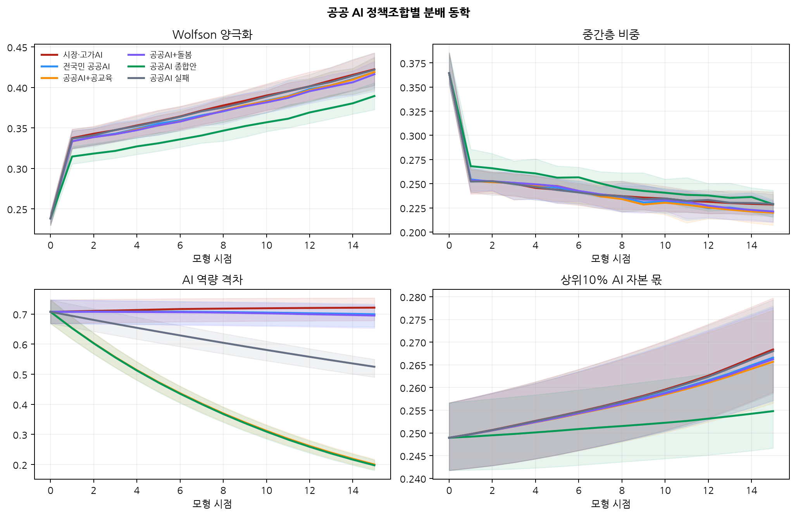
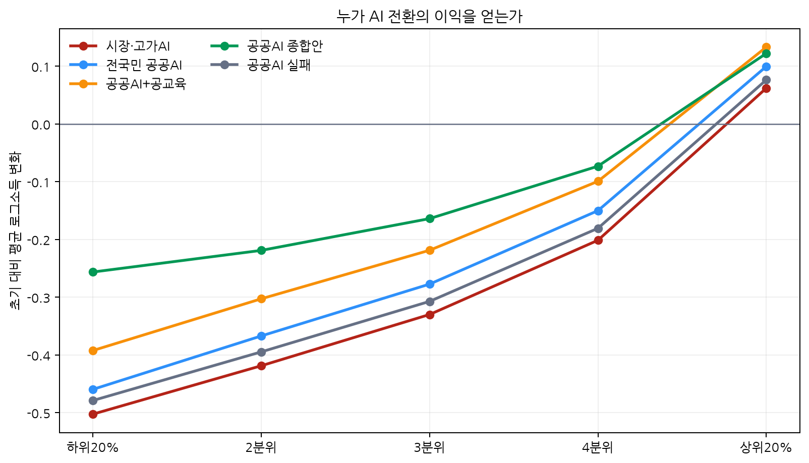
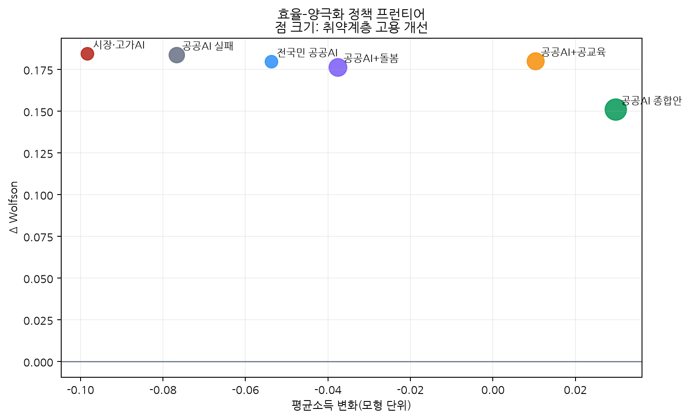
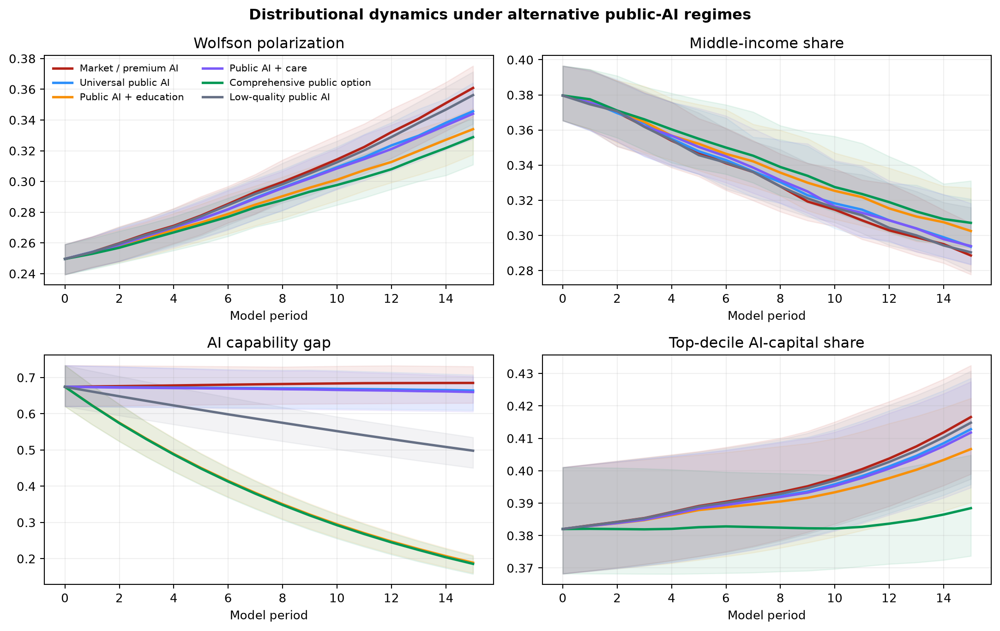
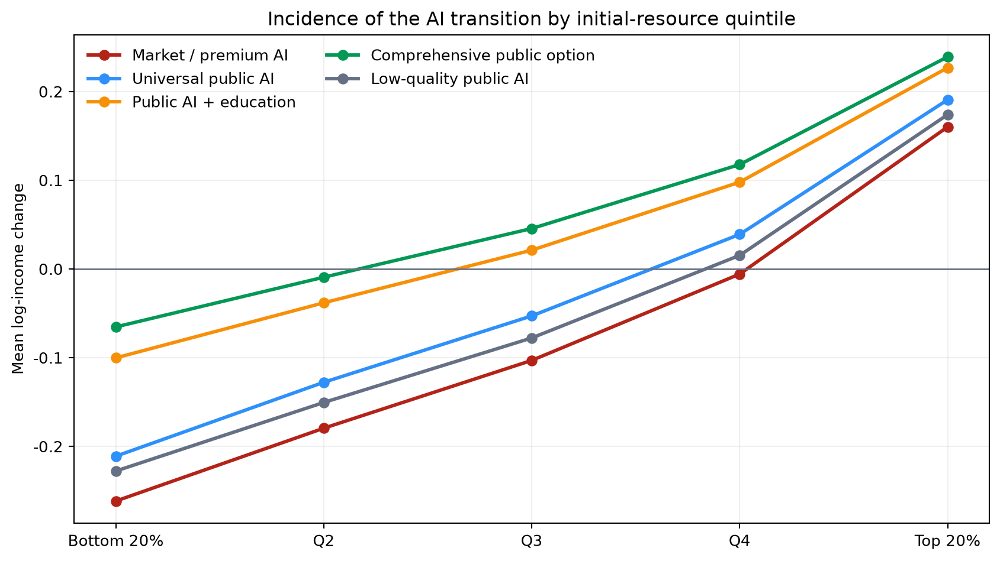
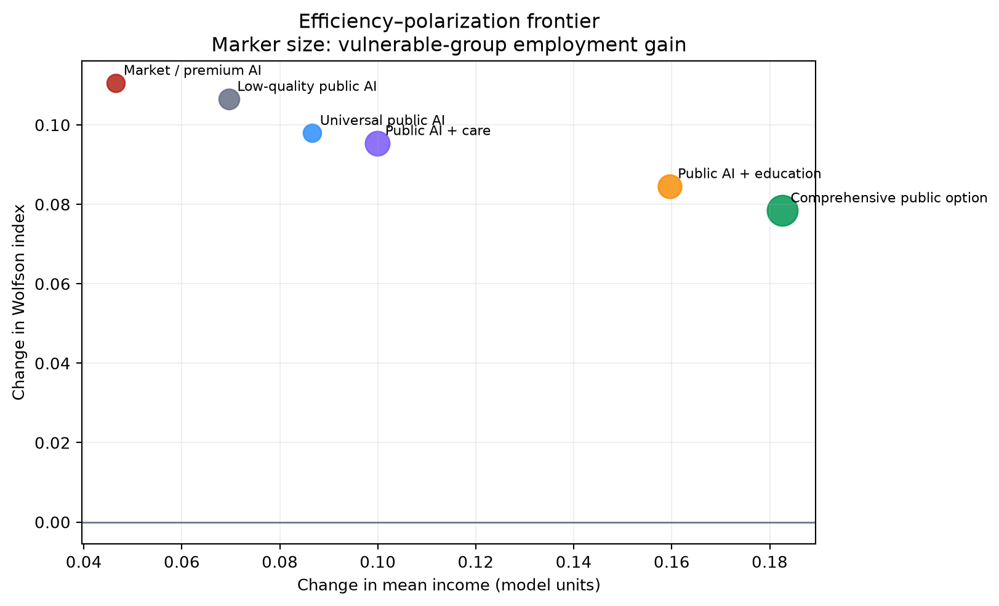
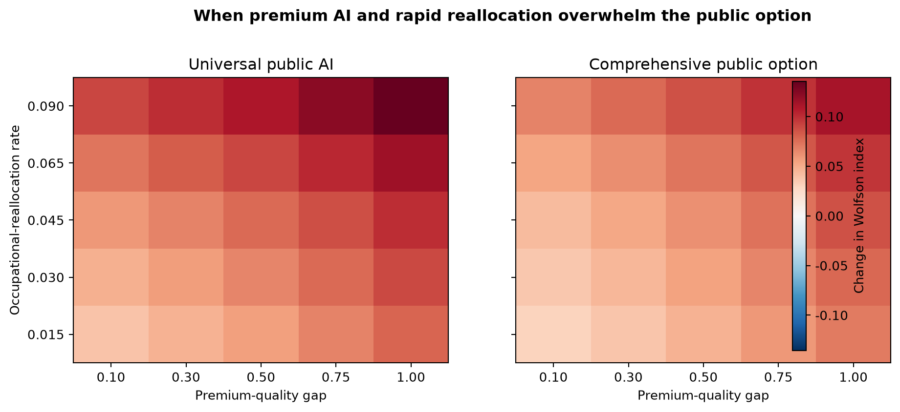
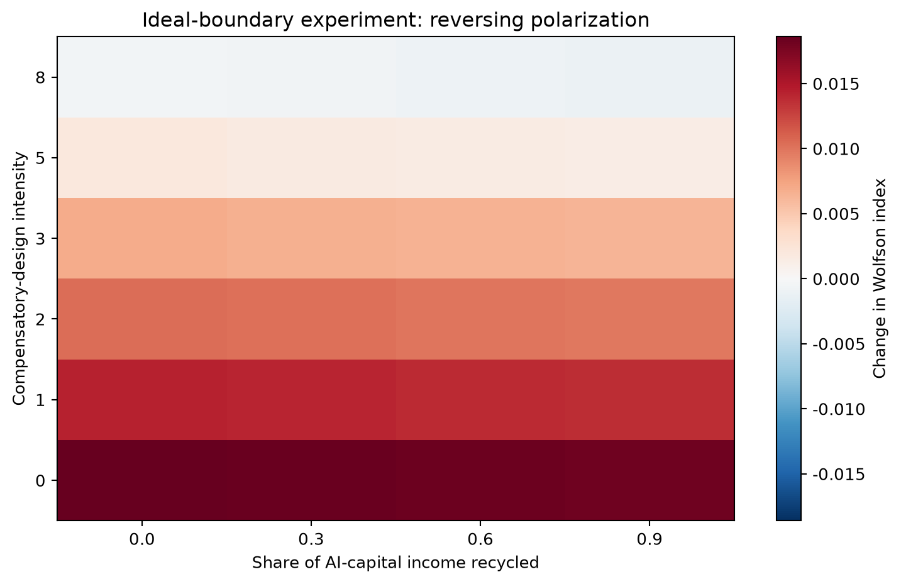
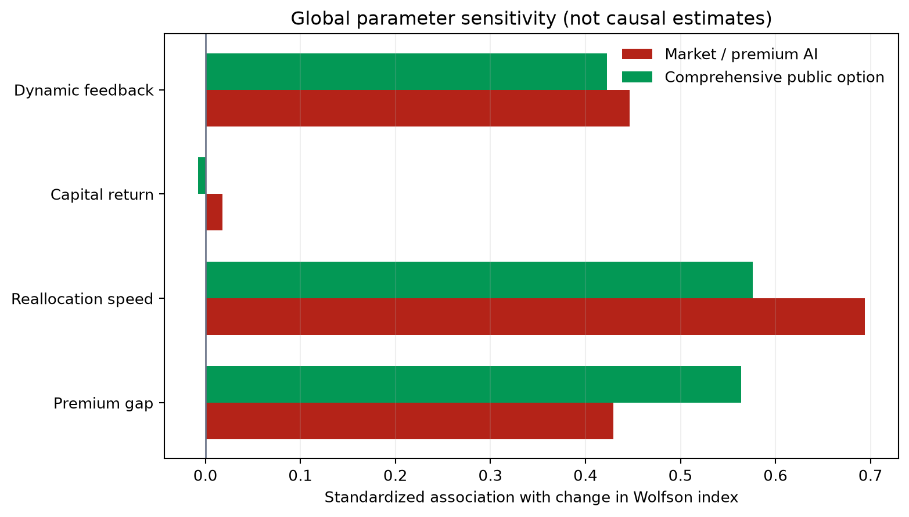
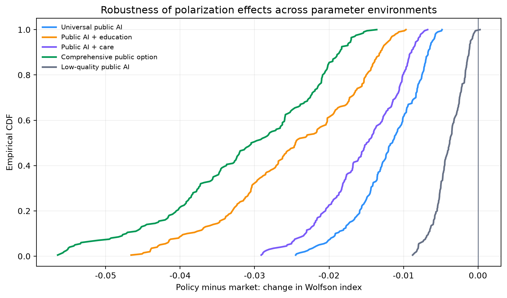

> **Working-paper status and interpretation.** This paper presents a calibrated computational thought experiment, not a forecast of Korea or any other economy. The simulated household population remains synthetic, and quantitative magnitudes should not be read as causal effects. What is *new in this revision* is that the previously assumption-based structural parameters—occupational-reallocation speed, the capital-income share, cross-industry productivity dispersion, and the regional-productivity penalty—are now **anchored to official Korean statistics retrieved directly from the KOSIS (Statistics Korea) and ECOS (Bank of Korea) OpenAPIs**. Every calibrated number is traceable to a statistics-table identifier and query date (see @sec-krcalib and `public/data/kr_real/MANIFEST.json`). The contribution is to identify mechanisms, discipline them with real Korean industrial and economic statistics, derive falsifiable comparative statics, and define an empirical research agenda.

> **국문 요약.** 본 연구는 보편적 공공·소버린 AI 서비스가 급속한 AI 확산이 초래하는 분배적 결과(양극화)를 완화할 수 있는지를 이질적 에이전트(heterogeneous-agent) 전이 모형으로 분석한다. 핵심은 **명목 접근(nominal access)과 실효 이용(effective use)의 구분**이다: 모두에게 무료로 AI를 제공해도 숙련·직무 유연성·프리미엄 모델 접근·자본 소유가 불평등하면 실효 이용과 경제적 성과는 벌어진다. 이번 개정본은 통계청 KOSIS와 한국은행 ECOS의 OpenAPI로 내려받은 **실제 한국 산업·경제 통계**로 모형의 핵심 파라미터를 보정하였다. 산업별 취업자(경제활동인구조사), 산업·지역별 노동생산성, 국민계정 기반 노동소득분배율을 사용해 (i) 직무 재배치 속도, (ii) 자본소득 비중, (iii) 산업 간 생산성 격차, (iv) 지역 생산성 페널티를 추정하였다. 분석 결과, 보편적 접근은 필요한 인프라이지만 그 자체로 양극화를 되돌리지 못하며, 적응형 교육·표적 돌봄·AI 자본의 광범위한 소유가 결합될 때에만 분배 개선이 나타난다. 모든 통계 수치는 통계표 ID와 조회일로 추적 가능하다.

# Abstract

This paper studies whether a universal public or sovereign artificial-intelligence service can limit the distributional consequences of rapid AI adoption. I develop a finite-horizon heterogeneous-agent transition model in which households differ in initial labor income, skills, AI-capital ownership, occupational exposure, adaptability, care burdens, trust, and ability to purchase premium AI. Effective AI use depends jointly on physical access, model quality, trust, skills, and occupational flexibility. AI can augment labor, displace tasks, increase returns to capital, reduce care-related barriers to employment, and generate cumulative advantages through dynamic feedback.

The model compares a market benchmark with five public-AI regimes: universal access, access plus public education, access plus AI-enabled care, a comprehensive public option, and a low-quality implementation. In the baseline calibration, universal access reduces the increase in the Wolfson polarization index by 11.4 percent relative to the market benchmark, while education and the comprehensive package reduce it by 23.5 and 29.0 percent. Yet polarization continues to rise under every realistic baseline regime because premium-model quality, skill complementarity, occupational reallocation, and unequal capital ownership continue to favor initially advantaged agents. A 3,600-run Monte Carlo exercise introduces uncertainty in premium quality, reallocation speed, AI-capital returns, dynamic feedback, and the marginal resource cost of public provision. Public AI plus education lowers polarization in every sampled environment and raises net equally distributed equivalent income in 59.0 percent; the comprehensive package lowers polarization in every environment but raises net output in only 43.5 percent because it is more costly. The results imply that universal access is a necessary infrastructure layer, not a sufficient distributional policy. Effective equalization requires compensatory design, adaptive education, targeted care, and broader ownership of AI capital. As a robustness check on real Korean structure, the same dynamics are re-run on a population whose demographic composition is drawn from the NVIDIA *Nemotron-Personas-Korea* dataset (30,463 age × sex × region × education × occupation strata) with parameters anchored to KOSIS and ECOS; the policy ranking is preserved and, on this realistic population, only the comprehensive package materially reduces polarization while raising vulnerable-group employment (@sec-realsim).

**Keywords:** artificial intelligence; public option; sovereign AI; inequality; polarization; occupational reallocation; education; digital public infrastructure  
**JEL codes:** D31, H41, I24, J24, O33

# Introduction

Generative AI is unusual among general-purpose technologies because a basic interface can diffuse almost instantly while frontier capability remains scarce, metered, and complementary with private data, organizational capital, and human expertise. This creates a two-layer distributional problem. The first layer is familiar: unequal access to devices, connectivity, and software. The second is more consequential: unequal access to model quality, inference budgets, proprietary data, workflow integration, and the human capital required to convert a model output into economic value.

Recent OECD data illustrate the first layer. In 2025, the difference in individual generative-AI use across age groups was 53.6 percentage points, while gaps by educational attainment and income were approximately 21 percentage points [@oecdaiuse2026]. The second layer is harder to observe but central to policy. The most capable systems are increasingly paywalled, and equal access to a generic interface does not imply equal effective capability. The World Bank's framework for AI readiness similarly emphasizes four complementary inputs—connectivity, compute, context, and competency—rather than connectivity alone [@worldbankdpi2026].

These facts motivate a policy proposal analogous to public broadband or digital public infrastructure: a universal public or sovereign AI option. Such a system could provide a minimum capability floor, support public administration, deliver curriculum-aligned tutoring, and help vulnerable households navigate health and social-protection systems. Public AI need not mean a single state-controlled chatbot. It can instead be a publicly financed entitlement delivered through interoperable public, private, open, and on-device models. OECD evidence on government AI already points toward mixed commercial and sovereign architectures rather than a single infrastructure model [@oecdgov2026].

The central question is whether such access is sufficient to prevent AI-driven polarization. The answer is not obvious. A public option may raise the productivity of disadvantaged workers, reduce care barriers, and broaden adoption. It may also be costly, poorly trusted, politically captured, or technologically inferior. Meanwhile, high-income households may purchase superior models and combine them with more skills and capital. If AI raises the return to capital, universal access may reduce wage inequality while wealth inequality continues to rise [@rockall2025].

This paper makes four contributions. First, it formalizes the distinction between nominal access and effective AI use. Second, it integrates task displacement, human-capital accumulation, care constraints, premium AI, and AI-capital ownership in one transparent transition model. Third, it distinguishes inequality from polarization by reporting the Gini, Atkinson, Wolfson, middle-income share, and capital concentration. Fourth, it evaluates policy robustness across uncertain technology and public-cost environments rather than presenting one preferred calibration.

The main result is conditional. Public AI robustly attenuates polarization in the model, but access-only provision does not reverse it. Education performs better because it changes the ability to use AI rather than merely the probability of access. Care services improve employment among vulnerable agents but have smaller aggregate distributional effects. A comprehensive package delivers the largest reduction in polarization and capital concentration, but its net efficiency ranking depends on implementation cost. A separate ideal-boundary experiment shows that polarization reverses only when public AI is strongly compensatory—providing substantially larger marginal productivity gains to initially low-capability agents—and when the premium-quality and occupational-displacement channels are nearly absent.

# Related Literature

The model builds on the task approach to technological change. Automation can displace labor from tasks, while new tasks and productivity effects can reinstate labor demand [@autor2015]. Acemoglu and Restrepo attribute a substantial part of changes in wage inequality to task displacement and differential exposure [@acemoglu2021]. In the present model, occupational exposure is not itself a treatment; outcomes depend on exposure interacted with effective use and adaptation.

AI differs from earlier automation because high-income cognitive occupations can be highly exposed while also being highly complementary with AI. An IMF task-based model shows that this can reduce wage inequality through displacement yet increase wealth inequality through capital returns and endogenous adoption [@rockall2025]. The present framework captures the same ambiguity in reduced form: an exposed agent may receive an augmentation gain, a displacement loss, or both.

Field evidence also motivates an equalizing channel. Generative AI raised productivity more for less experienced customer-support workers in one large deployment [@brynjolfsson2023]. This does not establish a general law, but it shows that technology can be designed or deployed so that lower baseline capability receives a larger marginal gain. I represent that possibility with a compensatory-design parameter.

The public-finance literature emphasizes uncertainty about AI growth, displacement, the labor share, and capital ownership. Robust policies may be preferable to point-optimal policies when the transition path is unknown [@dynan2026]. Korinek and Stiglitz argue that the distributional consequences of AI depend on property rights, market structure, and fiscal policy rather than technology alone [@korinek2019]. The simulations therefore evaluate both universal access and partial socialization of AI-capital income.

Finally, the paper relates to digital public infrastructure and education. Shared digital identity, payments, and secure data exchange can expand access to public services, but benefits require trust, interoperability, privacy, and institutional capacity [@worldbankdpi2026; @oecdgov2026]. In education, general-purpose AI may improve submitted work without producing durable learning when pedagogical design is absent [@oecd2026]. This motivates treating public education as a state transition for human capital, not as an additional login credential.

Korean evidence sharpens the distinction between exposure and complementarity. The Bank of Korea estimates that 51 percent of workers are in high-AI-exposure occupations: 24 percent in high-exposure, high-complementarity work and 27 percent in high-exposure, low-complementarity work [@bokai2025]. Its representative household survey reports 63.5 percent generative-AI use, 51.8 percent work use, and a 3.8 percent average reduction in work time, while documenting strong demographic and occupational gradients [@bokproductivity2025]. A separate study finds that early-career employment contracted more in highly exposed industries where junior codified tasks were easier to automate [@bokyouth2025]. These facts motivate a Korea extension with age-specific displacement and occupational mobility rather than a single national adoption parameter.

The extension also uses NVIDIA's `Nemotron-Personas-Korea` as a synthetic stratification stress test [@nvidia2026]. The dataset contains one million records and seven million Korean-language personas with adult age, sex, education, occupation, and 17-province context. It is not a survey. Its data card explicitly documents independence assumptions among demographic inputs, and recent audit evidence warns that marginal alignment does not establish joint-distribution fidelity [@bae2026]. Accordingly, the model uses only anonymized aggregate strata and treats official Korean joint tables and panel data as the empirical validation target.

# Economic Environment

## Households

The economy contains (N) heterogeneous households indexed by (i) over discrete periods $t=0,\ldots,T$. Each household has state

\[
s_{it}=(y_{it}^{L},h_{it},k_{it},e_i,f_i,b_{it},v_i,r_i),
\]

where (y^L) is labor income, $h\in[0,1]$ is AI-relevant human capital, (k>0) is AI-complementary capital, $e\in[0,1]$ is occupational AI exposure, $f\in[0,1]$ is occupational flexibility, $b\in[0,1]$ is a care or administrative burden, $v\in\{0,1\}$ indicates vulnerability, and $r\in[0,1]$ is the initial resource rank. Initial labor income and capital are lognormal and positively associated with the latent resource state. Skills and flexibility are correlated with the same state but retain idiosyncratic variation.

Households may purchase a premium AI service. The probability of premium adoption is

\[
\Pr(P_i=1)=\Lambda(-4.2+7r_i),
\]

where $\Lambda$ is the logistic function. This reduced-form adoption rule captures affordability and organizational complementarity. It is not a demand system estimated from prices.

## Effective AI services

Nominal access and effective use are distinct. Let (X_{it}^{G}) indicate successful access to the public service and (P_i) premium adoption. AI quality is

\[
q_{it}=\begin{cases}
1+\Delta_q, & P_i=1,\\
q_G, & P_i=0,\ X_{it}^{G}=1,\\
q_0, & \text{otherwise},
\end{cases}
\]

where $\Delta_q$ is the premium-quality advantage, (q_G) public quality, and (q_0) the residual low-quality service. Public access succeeds with probability

\[
\Pr(X_{it}^{G}=1)=x_G\tau_G\tau_i,
\]

where (x_G) is nominal coverage, $\tau_G$ institutional trustworthiness, and $\tau_i$ household trust. Effective AI services are

\[
a_{it}=q_{it}\Lambda(-0.8+2.5h_{it}+1.2f_i).
\tag{1}
\]

Equation (1) is the key distinction: universal nominal access does not equalize effective services if skills and flexibility remain unequal.

### Network diffusion and social-physics extension

Households are embedded in a weighted social-learning network (G=(V,E)), following the generative logic of agent-based social science and the econophysics tradition of deriving distributional regularities from interacting heterogeneous units [@epstein1999; @bouchaud2000]. Let (w_{ij}) denote normalized ties based on region, occupation, and resource similarity. Adoption and human capital receive peer terms,

\[
p_{i,t+1}=\operatorname{clip}\left[p_{it}+\delta X_{it}^{G}+\lambda\sum_jw_{ij}(p_{jt}-p_{it}),0,1\right],
\tag{1a}
\]

\[
h_{i,t+1}=\operatorname{clip}\left[h_{it}+\eta_G(1.15-r_i)(1-h_{it})
+\sigma\sum_jw_{ij}(h_{jt}-h_{it})+0.018a_{it}(1-h_{it}),0,1\right].
\tag{1b}
\]

Here $\lambda$ is social diffusion and $\sigma$ is peer learning. Homophily can produce capability clusters: the same spillover that accelerates national adoption may amplify between-cluster inequality when disadvantaged agents mainly connect to other low-skill agents. Progressive education can instead seed high-return nodes inside those clusters. The browser laboratory exposes these mechanisms and visualizes the resulting network; the publication model treats them as hypotheses pending Korean network calibration.

## Labor augmentation, displacement, and care

The growth rate of labor income is

\[
g_{it}=0.043e_i a_{it}(0.28+0.72h_{it})
+\chi e_iX_{it}^{G}(1-h_{it})(1-r_i)
-\rho e_i$1-\mathcal{A}_{it}$
+\gamma c_Gv_i(1-b_{it})+\phi g_{i,t-1},
\tag{2}
\]

where $\chi$ is compensatory design, $\rho$ occupational-reallocation speed, (c_G) care-service intensity, $\phi$ dynamic feedback, and

\[
\mathcal{A}_{it}=0.42h_{it}+0.28f_i+0.30\min(a_{it},1)
\]

is adaptive capacity. Labor income evolves as $y_{i,t+1}^{L}=y_{it}^{L}\exp(g_{it})$, with bounded period growth for numerical stability.

Public education changes human capital:

\[
h_{i,t+1}=\min\{1,h_{it}+\eta_G(1.15-r_i)(1-h_{it})+0.018a_{it}(1-h_{it})\}.
\tag{3}
\]

The first term is explicitly progressive. It represents more intensive support for low-resource, low-skill agents. Care services reduce (b_{it}) and increase the probability of employment among vulnerable agents. High-risk decisions in health, law, and benefits are outside the model and should not be delegated without human review.

## AI capital and household income

AI-capital income is

\[
\pi_{it}=r_K k_{it}e_i\min(a_{it},1.5),
\tag{4}
\]

where (r_K) is the return to AI-complementary capital. Capital evolves through depreciation, reinvested after-tax profit, a share of positive labor gains, and any worker-ownership grant. Total household income is

\[
y_{it}=y_{it}^{L}+\pi_{it}-T_{it}+D_{it}.
\tag{5}
\]

The government taxes a share $\tau_K$ of AI-capital income and returns the revenue to households with progressive weights $\omega_i\propto1.05-r_i$:

\[
\sum_i D_{it}=\sum_i T_{it}=\tau_K\sum_i\pi_{it}.
\tag{6}
\]

Equation (6) balances the redistributive account. Service provision has a separate real-resource cost:

\[
C_G=T\left[0.0035x_Gq_G^2+0.012\eta_G+0.010c_G+0.0015\omega_G\right],
\tag{7}
\]

where $\omega_G$ is worker-ownership intensity. Net output and net equally distributed equivalent (EDE) income subtract (mC_G), where $m\in[0.5,4]$ is a Monte Carlo marginal resource-cost multiplier. This is resource accounting, not a complete tax-incidence model.

# Comparative Statics

## Proposition 1: Universal access need not equalize outcomes

**Proposition 1.** Suppose premium adoption and skills are increasing in initial resources, $\partial P_i/\partial r_i>0$ and $\partial h_i/\partial r_i>0$. If AI is skill-complementary and premium quality exceeds public quality, then setting public nominal coverage to one does not in general eliminate the resource gradient in AI augmentation.

**Proof sketch.** From equations (1) and (2), labor augmentation is increasing in (q_i), (h_i), and their interaction. Universal public coverage removes the extensive access difference for nonpremium households but leaves premium quality and skill gradients intact. The derivative of augmentation with respect to (r_i) remains positive whenever the direct skill and premium-quality terms exceed the compensatory term (chi(1-h_i)(1-r_i)). Therefore equal access is not sufficient for equal marginal returns. (square)

## Proposition 2: A compensatory-design threshold exists

**Proposition 2.** Holding displacement and capital-income channels fixed, there exists a threshold $\chi^*$ above which the labor-augmentation gradient with respect to initial resources becomes nonpositive.

**Proof sketch.** The resource derivative of equation (2)'s augmentation terms is continuous and decreasing in $\chi$. At (chi=0), the derivative is positive under complementarity. For sufficiently large $\chi$, the progressive term dominates because it is decreasing in (h_i) and (r_i). The intermediate value theorem yields a threshold. This proposition concerns labor augmentation, not total income: unequal capital ownership can preserve overall polarization even when the labor gradient reverses. (square)

## Proposition 3: AI-enabled care has targeted labor-supply effects

**Proposition 3.** If care burdens reduce employment and public care weakly lowers those burdens, then care AI weakly raises employment for vulnerable agents, with no direct effect for agents with (v_i=0).

The proposition follows mechanically from the employment transition. Its empirical relevance depends on service take-up, error rates, human escalation, and whether saved administrative time translates into labor supply.

## Proposition 4: Distributional dominance does not imply net efficiency dominance

**Proposition 4.** A public option can lower polarization relative to the market benchmark while lowering net output when (mC_G) exceeds its gross productivity gain.

This distinction motivates reporting polarization, gross output, net output, and EDE income separately.

# Calibration and Computational Design {#sec-calib}

The baseline is a normalized calibration designed for mechanism comparison. It is not matched to Korean moments.

| Object | Baseline | Monte Carlo range | Interpretation |
|---|---:|---:|---|
| Agents | 1,400 | 900 in robustness | Synthetic households per run |
| Horizon | 15 | 12 in robustness | Model periods |
| Premium quality gap $\Delta_q$ | 0.45 | 0.05–1.05 | Frontier advantage |
| Reallocation speed $\rho$ | 0.045 | 0.01–0.10 | Task-displacement pressure |
| AI-capital return (r_K) | 0.065 | 0.02–0.11 | Return to AI-complementary capital |
| Dynamic feedback $\phi$ | 0.18 | -0.05–0.35 | Persistence of prior gains |
| Public-cost multiplier (m) | 1 | 0.5–4.0 | Procurement and fiscal efficiency |
| Baseline seeds | 40 | 3 per parameter draw | Idiosyncratic population variation |

Six policy regimes are evaluated.

1. **Market / premium AI:** residual low-quality access and resource-skewed premium adoption.
2. **Universal public AI:** high nominal coverage with moderate public quality.
3. **Public AI plus education:** progressive human-capital investment.
4. **Public AI plus care:** targeted reduction in care and administrative burdens.
5. **Comprehensive public option:** access, education, care, AI-capital dividend, and worker ownership.
6. **Low-quality public AI:** broad nominal coverage with low quality and trust.

The baseline comprises 240 policy runs. Two additional grids examine 600 premium-gap/reallocation combinations and 288 ideal-boundary combinations. The global robustness exercise contains 200 random parameter environments, three seeds, and six policies, for 3,600 runs. All comparisons are paired within the same environment and seed.

Outcomes include the Gini coefficient, Atkinson index with inequality aversion (epsilon=1), EDE income, Wolfson polarization, the share within 75–125 percent of median income, vulnerable-group employment, the skill gap, and the top-decile share of AI capital.

## Korea-calibrated extension and synthetic-persona protocol

The Korea extension separates calibration targets into three tiers. Tier 1 uses official or representative moments: the Bank of Korea exposure/complementarity shares, generative-AI adoption and time-saving estimates, age-specific employment responses, KOSIS joint demographic tables, and KLIPS occupational transitions. Tier 2 uses administrative or survey microdata under their respective access rules. Tier 3 uses `Nemotron-Personas-Korea` only to generate synthetic strata and rare-subgroup stress tests.

The NVIDIA preparation pipeline discards names and all narrative persona fields. It exports counts over age group, sex, region, education, and occupation. The simulator samples agents from those counts, then assigns economic states through transparent equations. This preserves provenance while preventing narrative personas from being mistaken for observed income, preferences, trust, or policy behavior. Every NVIDIA-based result must be accompanied by (i) the sampled record count, (ii) the dataset version and CC BY 4.0 attribution, (iii) comparison against Korean joint distributions, and (iv) a warning that the source is fully synthetic.

The interactive extension adds three Korea-relevant parameters: a junior-career displacement shock for codified entry tasks, a noncapital-region penalty on effective rather than nominal access, and network learning. These parameters are exploratory until estimated. They allow falsifiable experiments about why high national AI use can coexist with widening returns to AI.

# Empirical Calibration with Korean Official Statistics {#sec-krcalib}

The original working paper set its structural parameters by assumption for mechanism comparison. This revision replaces four of them with values estimated directly from official Korean statistics, retrieved programmatically from the KOSIS (Statistics Korea) and ECOS (Bank of Korea) OpenAPIs. The download and calibration are fully scripted (`scripts/10_download_kr_data.py`, `scripts/11_calibrate_from_kr_data.py`), and every series is logged with its statistics-table identifier and query date in `public/data/kr_real/MANIFEST.json`. This section reports the anchors; it does not claim to estimate causal effects.

| Parameter | Meaning in the model | Real Korean anchor | Value | Source table |
|---|---|---|---:|---|
| $\kappa_K$ | AI-capital income channel weight | 1 − labor income share (5-yr mean) | **0.327** | ECOS 200Y116 |
| $\rho$ | occupational-reallocation speed | mean annual cross-industry employment reallocation | **0.0136** | KOSIS DT_1DA9003S |
| $\zeta$ | industry productivity heterogeneity | s.d. of industry labor-productivity growth | **0.115** | KOSIS DT_344N_1D8A_AA |
| $\psi$ | non-capital-region penalty | top–bottom regional manufacturing productivity gap | **0.569** | KOSIS DT_344N_1D8B_DD |

Three findings are worth stating because they discipline the model rather than merely decorate it.

**The labor income share rose, so the capital channel is real but not dominant.** Using compensation of employees over factor-cost national income (ECOS 200Y116), the Korean labor income share moved from 62.3 percent in 2015 to 67.4 percent in 2024, implying a capital income share near one-third. The model therefore treats the AI-capital channel as a material but secondary force, consistent with the paper's finding that capital returns affect wealth concentration more than the Wolfson index.

**Observed cross-industry reallocation is smaller than the synthetic baseline.** The mean annual sum of absolute industry-employment share changes across 21 industries (KOSIS DT_1DA9003S, seasonally adjusted, 2013–2025) is only 0.0136, well below the 0.045 baseline used in the thought experiment. This tempers alarmist reallocation narratives: at the national aggregate, Korean employment has re-sorted across industries slowly. It also sharpens the paper's warning—if AI accelerates this historically slow reallocation, the displacement channel that the model shows to be the largest driver of polarization would move into an unfamiliar regime.

**Regional productivity dispersion is large.** Manufacturing labor productivity across 18 regions (KOSIS DT_344N_1D8B_DD, 2024) ranges from an index of 128 in the lowest region to 297 in the highest, a 57 percent top-to-bottom gap. This supports modeling a non-capital-region penalty on *effective* rather than nominal AI access: a universal login does not equalize the organizational and capital context in which AI is actually used.

These anchors are substituted into the calibration table of @sec-calib as empirically grounded central values; the Monte Carlo ranges are retained around them so that the robustness exercise still spans plausible uncertainty. The synthetic-population caveat is unchanged: real parameters discipline the mechanisms, but the household cross-section is still simulated and must not be read as a Korean sample.

# Simulation on a Real Korean Population: NVIDIA × KOSIS × ECOS {#sec-realsim}

The baseline experiment (@sec-baseline) draws agents from a latent Gaussian. This section re-runs the same transition dynamics on a population whose demographic *structure* is taken from a real Korean dataset and whose transition parameters are anchored to the KOSIS/ECOS values of @sec-krcalib. Three independent real sources are combined:

1. **Population — NVIDIA Nemotron-Personas-Korea.** 100,000 streamed records are aggregated into 30,463 anonymized strata over age group × sex × region × education × occupation (`scripts/09`). Only counts are retained; names and free-text personas are discarded. This dataset is fully synthetic and marginal-aligned, so it is used for demographic *structure only*, never as a survey.
2. **Dynamics parameters — KOSIS.** Occupational-reallocation speed is set to the observed $\rho = 0.0136$; a non-capital-region effective-access penalty is read directly from regional manufacturing labor productivity (DT_344N_1D8B_DD), giving a region-capacity ratio of 0.92 (수도권), 0.93 (영남), 1.00 (호남), 0.94 (충청), and 0.70 (강원·제주).
3. **Capital channel — ECOS.** Each agent's capital stock is scaled so the initial AI-capital income share equals the real Korean value $\kappa = 0.327$ (realized share in the simulated population: 0.327).

Economic states are then assigned by transparent rules: education level maps to baseline skill (무학 0.10 → 대학원 0.85), occupation maps to AI exposure and complementarity (professional/clerical work high-exposure, manual/service low-complementarity, 무직 non-employed and vulnerable), and region maps to the effective-access capacity above. The dynamics, metrics, and redistribution accounting are identical to @sec-baseline (the exact-balance budget error is $<10^{-13}$). Full code: `scripts/12_public_ai_real_simulation.py`; outputs in `results/public_ai_real/`.

## Results on the real population

Across 24 seeds and six policies (144 paired runs, 15 periods), the ranking of policies is preserved, but the levels shift in an economically meaningful way.

| Policy | Δ Wolfson | Δ Gini | Δ middle share | Δ net EDE | Δ vulnerable emp. |
|---|---:|---:|---:|---:|---:|
| Market / premium AI | 0.185 | 0.159 | −0.138 | −0.260 | −0.2 pp |
| Universal public AI | 0.180 | 0.151 | −0.146 | −0.248 | −0.2 pp |
| Public AI + education | 0.180 | 0.149 | −0.149 | −0.219 | +2.7 pp |
| Public AI + care | 0.177 | 0.148 | −0.146 | −0.247 | +3.2 pp |
| Comprehensive public option | **0.151** | **0.124** | −0.138 | **−0.186** | **+6.1 pp** |
| Low-quality public AI | 0.184 | 0.158 | −0.139 | −0.258 | +1.6 pp |

{fig-alt="Dynamics of Wolfson polarization, middle-income share, skill gap, and top-decile AI-capital share on the NVIDIA Korean population" width=100%}

{fig-alt="Log-income change by initial-resource quintile on the real Korean population" width=95%}

{fig-alt="Efficiency-polarization frontier on the real Korean population" width=90%}

Three findings stand out because they come from real Korean structure, not from a chosen calibration.

**Slow historical reallocation does not neutralize polarization.** Even with the empirically small $\rho = 0.0136$, polarization rises under every regime. In the model the driver is not the *speed* of reallocation but the education–occupation–capital gradient carried by the real population: because Korean skill, premium-AI affordability, and capital ownership are jointly concentrated, a universal login leaves the main gradient intact. This is the paper's central thesis, now reproduced on a real demographic cross-section rather than a stylized one.

**On the real population the comprehensive package is the only clear improver.** It cuts the rise in Wolfson polarization by about 18 percent relative to the market benchmark (0.151 vs 0.185), roughly halves the deterioration in inequality-adjusted (EDE) welfare, and is the only regime that raises vulnerable-group employment by more than five percentage points. Education is the pivotal active ingredient: adding it is what turns the vulnerable-employment effect positive.

**A real Korean population is harder to equalize than a synthetic one.** Net EDE income is negative under every regime in this population, because the NVIDIA cross-section carries a large non-employed and low-education mass (37 percent recorded as 무직 in the strata) that the market allocation leaves behind. This strengthens, rather than softens, the paper's policy conclusion: on realistic Korean demographics, universal access alone is clearly insufficient, and only a compensatory package with adaptive education and broadened AI-capital ownership moves the distribution.

These results remain model-conditional comparative statics. The NVIDIA population is synthetic and marginal-aligned, the occupational exposure mapping is a transparent rule rather than an estimate, and no general-equilibrium wage adjustment is modeled. What is new is that the qualitative conclusions survive when the population structure and the key parameters are replaced by official Korean statistics.

# Robustness on the Real Population: Confidence Intervals, Ablations, Finite Size {#sec-rigor}

The real-population results above are upgraded to publication-grade with paired Monte Carlo, mechanism ablations, and finite-size scaling (`scripts/13_rigor_experiments.py`; `results/rigor/rigor_report.json`). The population is the governance-validated broad-occupation profile (3,405 strata; the skill's `validate --strict` passes with no forbidden narrative fields), and the pre-registered hypotheses and permitted claims are fixed in `research-contract.md`.

**Paired Monte Carlo (40 seeds, common random numbers, n = 1,600).** Every policy raises Wolfson polarization with a 95% confidence interval strictly above zero, confirming H1 (universal access does not by itself reverse polarization). The comprehensive package has the lowest rise, and the paired market-minus-comprehensive difference is +0.0275 with a 95% CI of [0.0252, 0.0298], which excludes zero, confirming H2.

| Policy | Δ Wolfson (mean) | 95% CI | Δ vulnerable emp. |
|---|---:|---|---:|
| Market / premium AI | 0.1915 | [0.187, 0.196] | −0.2 pp |
| Universal public AI | 0.1903 | [0.186, 0.194] | −0.2 pp |
| Public AI + education | 0.1943 | [0.190, 0.198] | +2.5 pp |
| Public AI + care | 0.1866 | [0.183, 0.191] | +3.2 pp |
| Comprehensive public option | **0.1639** | **[0.161, 0.167]** | **+5.9 pp** |
| Low-quality public AI | 0.1924 | [0.188, 0.197] | +1.6 pp |

**Mechanism ablations decompose the package into two distinct channels.** Removing each mechanism from the comprehensive package in turn shows that the polarization effect and the employment effect run through *different* levers:

| Ablation | Δ Wolfson | Δ vulnerable emp. |
|---|---:|---:|
| Full comprehensive package | 0.1639 | +5.9 pp |
| − capital dividend / ownership | **0.1899** | +5.9 pp |
| − care | 0.1667 | +2.5 pp |
| − education | 0.1607 | +3.2 pp |
| − compensatory design | 0.1643 | +5.9 pp |

Removing capital-income recycling and worker/citizen ownership raises polarization the most (0.164 → 0.190), so **broadened AI-capital ownership is the dominant polarization-reducing mechanism** in this population. Removing education or care roughly halves the vulnerable-employment gain (5.9 pp → 3.2 / 2.5 pp) while barely moving polarization, so **education and care are the employment-inclusion mechanisms**. This refines the paper's earlier "education is pivotal" statement into a two-channel result: education and care raise vulnerable-group employment, whereas capital ownership is what actually compresses the distribution.

**Finite-size scaling.** The market-versus-comprehensive ordering is stable and non-vanishing across n ∈ {250, 500, 1,000, 2,000} (market Δ Wolfson 0.207 → 0.191, comprehensive 0.176 → 0.165), so the result is not a small-sample artifact. Remaining skill gates—global Sobol sensitivity, network-topology variation, and hysteresis on policy-withdrawal paths—are documented as the next phase in `research-contract.md`.

# Baseline Results {#sec-baseline}

## Dynamic distributional effects

{fig-alt="Dynamic paths of Wolfson polarization, middle-income share, AI capability gap, and top-decile AI-capital share across six policy regimes" width=100%}

The market benchmark produces the fastest increase in polarization and AI-capital concentration. Universal access attenuates both but leaves most of the skill gradient intact. Education and the comprehensive option sharply reduce the capability gap because education is targeted toward initially low-resource agents. The comprehensive option also slows capital concentration through progressive dividends and ownership grants.

| Policy | Δ Wolfson | Δ Atkinson | Fiscal cost | Δ net output | Δ net EDE | Vulnerable employment |
|---|---:|---:|---:|---:|---:|---:|
| Market / premium AI | +0.1105 | +0.0969 | 0.0000 | +0.0464 | -0.0756 | -0.99 pp |
| Universal public AI | +0.0979 | +0.0870 | 0.0267 | +0.0599 | -0.0587 | -0.93 pp |
| Public AI + education | +0.0845 | +0.0738 | 0.0463 | +0.1133 | -0.0035 | +2.05 pp |
| Public AI + care | +0.0954 | +0.0848 | 0.0426 | +0.0573 | -0.0614 | +2.46 pp |
| Comprehensive public option | +0.0784 | +0.0685 | 0.0664 | +0.1162 | +0.0020 | +5.49 pp |
| Low-quality public AI | +0.1065 | +0.0926 | 0.0153 | +0.0543 | -0.0676 | +0.85 pp |

Gross mean income rises under every regime, but market EDE income falls. This divergence means that aggregate growth is not sufficient to improve inequality-adjusted welfare in the model. Only the comprehensive package produces positive net EDE income at the baseline cost, and its margin is small.

## Incidence across the initial-resource distribution

{fig-alt="Mean log-income changes by initial-resource quintile across selected policy regimes" width=95%}

All realistic baseline policies retain a positive resource gradient: top-quintile agents gain most, while the bottom quintile loses. Public education and the comprehensive option shift the entire incidence schedule upward, but do not reverse its slope. Thus AI can simultaneously raise mean productivity and deepen distributional segmentation.

## Efficiency and polarization

{fig-alt="Efficiency-polarization frontier with marker size showing vulnerable-group employment gains" width=92%}

Before introducing uncertainty in public cost, the comprehensive option occupies the most favorable gross-output/polarization location. This is not a general dominance result. The Monte Carlo exercise below shows that cost uncertainty materially changes the net-output ranking.

# Threshold Experiments

## Premium quality and occupational reallocation

{fig-alt="Heat maps of changes in Wolfson polarization over premium-quality gaps and occupational-reallocation speeds" width=100%}

Polarization increases with both premium quality and reallocation speed. The comprehensive option reduces the level at every grid point but does not eliminate polarization in the high-gap, high-reallocation region. Public provision therefore becomes less effective when education and labor-market adaptation lag behind frontier-model improvements.

## The ideal compensatory boundary

{fig-alt="Ideal-boundary heat map of polarization over compensatory design and recycled AI-capital income" width=90%}

This experiment deliberately removes the premium-quality and occupational-reallocation shocks and strengthens public quality, education, and trust. Even then, greater capital-income recycling alone does not reverse polarization. Negative Wolfson changes appear only at the highest compensatory-design intensity. The units are arbitrary and should not be interpreted as a policy target. The experiment establishes a qualitative point: neutral access and lump-sum redistribution are weaker than technology designed to generate larger marginal productivity gains for initially disadvantaged users.

# Global Robustness

## Parameter sensitivity

{fig-alt="Standardized associations of uncertain technology parameters with Wolfson polarization under market and comprehensive public AI" width=90%}

Under the market benchmark, occupational-reallocation speed has the largest standardized association with polarization (0.694), followed by dynamic feedback (0.446) and the premium-quality gap (0.429). Under the comprehensive option, reallocation speed (0.576) and the premium gap (0.564) are nearly equally important. Capital returns have little standardized association with the Wolfson index in this parameterization, although capital returns still affect wealth concentration and EDE income. These coefficients summarize the simulated parameter space; they are not causal estimates.

## Policy-effect distributions

{fig-alt="Empirical cumulative distributions of policy effects on Wolfson polarization relative to the market benchmark" width=92%}

| Policy | Lower polarization | Higher net output | Higher net EDE | Net-output & polarization improvement |
|---|---:|---:|---:|---:|
| Universal public AI | 100.0% | 27.5% | 33.0% | 27.5% |
| Public AI + education | 100.0% | 53.5% | 59.0% | 53.5% |
| Public AI + care | 100.0% | 19.0% | 22.5% | 19.0% |
| Comprehensive public option | 100.0% | 43.5% | 45.5% | 43.5% |
| Low-quality public AI | 99.5% | 27.5% | 28.0% | 27.5% |

Every substantive public option reduces polarization in all 200 sampled environments. This robustness is partly structural: each policy expands effective services toward households that otherwise lack premium AI. Net efficiency is not structural because costs vary. Education has the highest probability of improving both net output and polarization, while care is targeted toward a smaller population and consequently has lower aggregate net-output dominance despite clear vulnerable-group benefits. The comprehensive package produces the largest median polarization reduction but is more sensitive to cost overruns.

# Political Economy and Institutional Design

The model does not justify a unitary state AI. A monopoly public model may introduce surveillance, political bias, slow procurement, and technological lock-in. Nor does a voucher-only system guarantee equity if private suppliers segment users by quality or extract sensitive public data. A durable public option should separate the **entitlement** from the **operator**.

A plausible institutional architecture has five layers:

1. A statutory minimum AI entitlement or compute credit.
2. Choice among certified public, private, open-weight, and on-device models.
3. Interoperability and data portability, with privacy-preserving processing for sensitive data.
4. Independent evaluation of quality, security, bias, and distributional incidence.
5. Human explanation, escalation, and appeal rights for consequential public decisions.

This design may be more robust to electoral turnover than tying public access to a specific vendor or model. The entitlement and safeguards can remain stable while procurement and pedagogy adapt.

## A Korea-specific policy architecture

For Korea, a universal account should be evaluated as the first layer of a five-part package rather than a complete program. The second layer is progressive AI and job-transition education measured by unaided retention, not course completion. The third is career-ladder insurance: paid training, transition income, and incentives to redesign junior roles rather than remove them. The fourth is human-reviewed care and administrative assistance with appeal rights. The fifth creates citizen claims on AI capital through pension exposure, worker ownership, regional compute funds, or other durable assets.

The policy dashboard should report four joint gates: lower Wolfson polarization and capability gaps than the market benchmark; nonnegative cost-adjusted EDE income; no deterioration in vulnerable employment or junior career entry; and auditable data, model choice, human escalation, and supplier switching. No scalar welfare score should override a failure on rights or safety.

# Empirical Identification Agenda

The present model cannot determine whether a public AI program would work in practice. A credible empirical program would proceed in stages.

**First, measure the premium gap.** A common task battery should compare free, public, and premium models for users with different baseline skills. Outcomes should include task completion, error detection, time, and unaided retention—not model benchmarks alone.

**Second, randomize access and education separately.** A factorial trial should assign public-AI access, structured training, both, or neither. This identifies whether access changes outcomes and whether education changes the return to access. Removing AI during a later assessment can distinguish durable learning from temporary task outsourcing.

**Third, evaluate care AI with administrative outcomes.** Eligible take-up, processing time, appeals, erroneous denials, and human escalation should be measured. Employment is secondary and should not be assumed to respond immediately.

**Fourth, link occupational exposure to observed transitions.** Longitudinal labor data can estimate whether high-exposure workers change occupations, wages, hours, or training participation. Exposure is not randomly assigned; identification requires event studies, firm-level adoption timing, or valid instruments.

**Fifth, measure ownership.** Household portfolios, pension exposure, employee ownership, and regional funds are necessary to identify the capital-income channel. Wage data alone may falsely suggest equalization while wealth concentration rises.

All human-subject research requires ethics review before recruitment, informed consent, privacy protection, and pre-specified exclusion and outcome rules. Synthetic personas may help test survey instruments but cannot substitute for a representative human sample.

# Limitations

The paper has nine important limitations.

1. It is a partial-equilibrium transition model. Wages, prices, firm entry, labor demand, and aggregate savings do not clear in equilibrium.
2. Premium adoption is a reduced-form function of initial resources rather than a price-sensitive choice.
3. Public-service cost is a normalized resource cost, not a full government budget with distortionary taxation.
4. Policy quality, trust, and targeting are assumed rather than estimated.
5. The simulated population is synthetic and is not calibrated to Korean joint distributions.
6. The Wolfson and Atkinson results depend on the chosen income definition and finite horizon.
7. Monte Carlo robustness shows stability within the specified model family, not external validity.
8. The network topology in the interactive extension is stylized; diffusion and homophily are not yet estimated from Korean social or workplace networks.
9. NVIDIA's Korean personas are fully synthetic and may align with marginal distributions while misrepresenting important demographic joints. They support stress testing, not population inference.

These limitations imply that the paper should be read as theory-assisted policy design. Its quantitative findings discipline intuition, expose hidden assumptions, and identify empirical thresholds. They do not rank actual programs.

# Conclusion

Universal public AI can reduce the first-order access gap, but access equality is not outcome equality. When frontier quality, skills, organizational flexibility, and AI-capital ownership are positively associated with initial resources, a universal login leaves the main gradient of economic returns intact. The model therefore predicts that a market with low-quality free AI for the poor and premium AI plus private data and capital for the rich can increase output while hollowing out the middle.

The most robust modeled intervention is not access alone but access combined with adaptive public education. A comprehensive package generates the largest distributional gains and vulnerable-group employment effects, but its net efficiency is sensitive to cost. Pure capital-income recycling is weaker than compensatory design unless it changes ownership at scale or is combined with human-capital formation.

The policy objective should therefore be a public AI option that increases the capabilities, time, bargaining power, and capital claims of initially disadvantaged users—not merely a cheaper chatbot. Whether such a system can be delivered at acceptable cost is an empirical question. The model provides the hypotheses and measurement framework required to answer it.

# Reproducibility Appendix

- Core model: `scripts/07_public_ai_policy_simulation.py`
- Robustness code: `scripts/08_economics_robustness.py`
- NVIDIA aggregate-profile bridge: `scripts/09_prepare_nvidia_korea_personas.py`
- Interactive network model: `src/simulation/model.ts`
- Three-dimensional policy laboratory: `src/components/InequalityWorld.tsx`
- Unit tests: `tests/test_public_ai_policy.py`
- Baseline outputs: `results/public_ai_full4/`
- Robustness outputs: `results/economics_robustness_full/`
- Publication-scope model tests: 4 (the broader development workspace passed 17 tests before repository extraction)
- Baseline and threshold runs: 1,128
- Monte Carlo runs: 3,600
- Total computational experiments used in this paper: 4,728

# References
